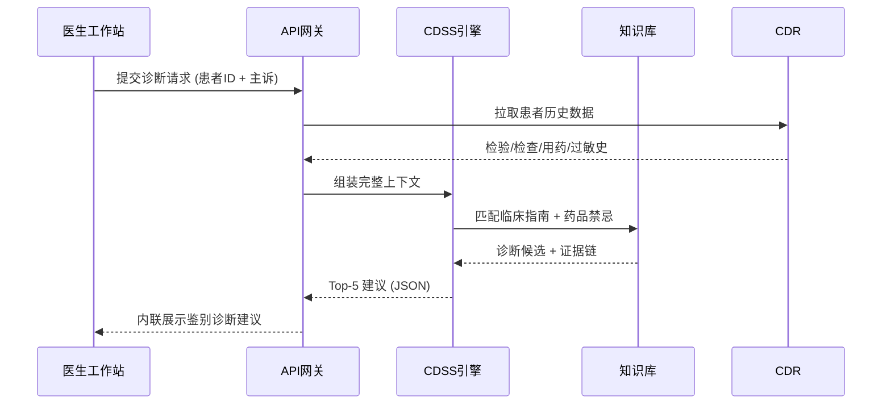

# 散文体 vs 矩阵体 写法对比

> V5.0 核心约束 2.1："战略用散文，战术用矩阵"。本文件展示同一内容在两种表达模式下的写法。

---

## 场景：门诊 CDSS 辅助诊断系统

### 📖 散文体写法（用于"业务蓝图 / 背景 / 愿景"章节）

当一位基层全科医生面对一名主诉"胸闷、气短三天"的 62 岁男性患者时，他的鉴别诊断决策窗口可能只有短短几分钟。传统模式下，医生依赖个人经验与有限的辅助检查结果做出判断，而急性冠脉综合征的漏诊率在基层机构高达 12%。

CDSS 的介入并非要替代医生的临床判断，而是在诊断决策的关键 30 秒内，基于患者的主诉、现病史、心电图结果和既往用药史，自动推送 3-5 条按概率排序的鉴别诊断建议——将原本需要高年资专家才能完成的思维过程，压缩为一次可视化的决策辅助。这意味着当小镇卫生院的年轻医生，能够获得与三甲医院主任同等水平的诊断提示时，"大病不出县"才不再只是一句政策口号。

---

### 📊 矩阵体写法（用于"IT 架构 / 接口 / 数据流"章节）

#### CDSS 辅助诊断系统技术规格

| 维度 | 规格 | 说明 |
|:---|:---|:---|
| 触发机制 | 医嘱保存前自动触发 | 嵌入医生工作站工作流，无需额外操作 |
| 输入数据源 | 主诉 + 现病史 + 检验检查 + 用药史 | 通过 HL7 FHIR 接口实时获取 |
| 知识库 | ICD-10 映射 + 临床指南 + 药品库 | 季度更新，覆盖 300+ 常见病种 |
| 输出格式 | Top-5 鉴别诊断 + 置信度 + 推荐检查 | 结构化 JSON 返回，工作站内联展示 |
| 响应时间 | ≤ 500ms | P99 延迟标准 |
| HITL 协议 | 医生可接受/驳回/修正 AI 建议 | 所有操作留痕，支持事后审计 |

#### 数据流向图

---

## 分界原则速查

| 章节类型 | 使用散文体 | 使用矩阵体 |
|:---|:---:|:---:|
| 背景与挑战 | ✅ | ❌ |
| 愿景与业务价值 | ✅ | ❌ |
| 患者旅程重塑 | ✅ | ❌ |
| IT 应用架构 | ❌ | ✅ |
| 数据流向与接口 | ❌ | ✅ |
| API / 数据字典 | ❌ | ✅ |
| 实施路线图 | ❌ | ✅ |
| TCO / ROI 测算 | ❌ | ✅ |
| 信创适配清单 | ❌ | ✅ |

> **铁律**：如果你在写数据流向时用了超过 3 句散文，立即切换为表格或 Mermaid 图。如果你在写业务愿景时全是表格，立即切换为散文。
