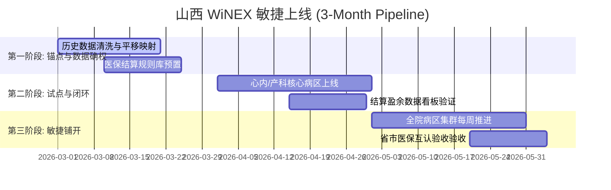

# 03_tactics.md - 落地战术与分步实施计划 (V4.1)

## 1. 全院区 3 个月“安全着陆”甘特图

## 2. RACI 执行责任矩阵

| 关键里程碑 | 负责人 (R) | 问责人 (A) | 咨询人 (C) | 通知人 (I) |
| :--- | :--- | :--- | :--- | :--- |
| **医保盈余逻辑闭环** | 卫宁战略咨询部 | 山西省区总 | 省医保局专家 | 院长 |
| **3个月安全上线** | 华北交付中心 | 项目经理 | 客户 CIO | 临床主任 |
| **数据平移完整性** | 数据工程部 | 交付负责人 | 原系统维护商 | CIO |

## 3. Pre-Mortem: 事前验尸与风险补丁
假设 2027 年山西项目大面积失败，倒推核心死因及对策：
*   **死因 1：本地交付资源过载**。由于 3 个月上线节奏太快，山西本地工程师疲于奔命导致质量坍塌。
    *   **补丁**：成立“山西战时交付团”，从上海/杭州抽调 30 名具备 Ready 批量交付经验的资深架构师入晋驻场。
*   **死因 2：数据异构导致业务中断**。
    *   **补丁**：强制预演“双态并行”策略，核心业务数据在旧 C/S 和新 WiNEX 中实现 7*24h 同步，确保秒级回滚能力。
*   **死因 3：医保政策突变**。
    *   **补丁**：WiNEX 语义层必须支持“热更新”，确保山西省内任何细微的分组调整能在 24 小时内全省映射。
