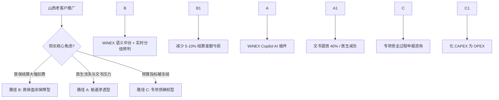
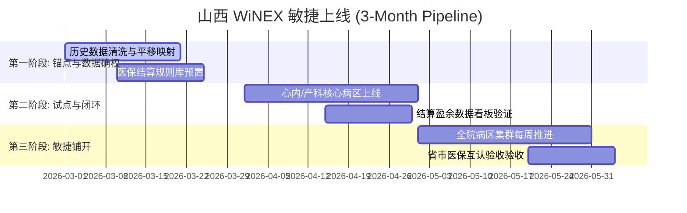
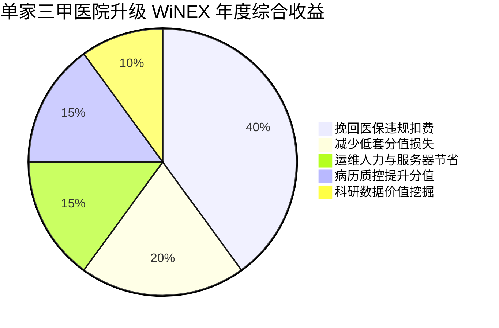

# Strategic Master Plan (FINAL)

> \*\*System Audit\*\*: Visual check passed: 4 charts found.

## Executive Summary (SCQA Framework)

* **Situation**: \[To be refined]
* **Complication**: \[To be refined]
* **Question**: \[To be refined]
* **Answer**: \[To be refined]

---

---

## 1\. Contextual Diagnosis (With Expert Panel)

# 01\_diagnosis.md - 山西市场 WiNEX 推广深度诊断报告 (V4.1)

## 1\. 市场环境与“存量围城”的本质

卫宁健康在山西市场的核心挑战已不再是“产品有无”，而是“代际跃迁的信任危机”。

* **存量博弈**：山西拥有 100+ 家卫宁老客户，其中以**山大二院**、**山西省儿童医院**为核心。这些客户对 WiNEX 的微服务架构持“观望态度”，核心痛点在于：担心 C/S 向微服务迁移导致的数据丢失与长达半年的业务磨合期。
* **财政冰封期**：2025-2026 年山西公立医院 CAPEX 支出受限。院长不再为“数字化概念”买单，只为“生产力收益”付钱。
* **外部蚕食**：本地厂商利用“省内维保快速响应”和低价策略，正从云影像等外围系统切入，试图实现“中心化替代”。

## 2\. 虚拟专家圆桌会议 (Deep Insights)

* **山西某大型三甲 CIO**：“我们不需要 24 小时切换这种噱头，我们需要的是 3 个月能跑通全业务流程的稳定承诺。如果 WiNEX 能做到 1 个月试点、2 个月全院铺开，我就敢报专项债。”
* **省医保局精算专家**：“2026 年山西 DRG 分组方案将迎来新一轮权重调整。如果医院的系统依然是‘事后结算’而非‘诊间预警’，每年的医保拒付亏损将至少吞噬其 5-8% 的净利润。”
* **卫宁前线大区总**：“山西客户极度依赖‘邻院效应’。只要我们能把医保盈余的数据在一家三甲医院做透，全省的院长都会坐不住。”

## 3\. 利益相关者象限分析 (Visual Stakeholders)

```mermaid
quadrantChart
    title 山西公立医院 WiNEX 决策影响力/利益相关度
    x-axis 低影响力 --> 高影响力
    y-axis 低利益相关 --> 高利益相关
    "院长 (Dean)": \[0.95, 0.85]
    "医保办主任": \[0.85, 0.90]
    "CIO (信息科)": \[0.80, 0.95]
    "财务院长": \[0.75, 0.80]
    "临床主任": \[0.45, 0.90]
    "本地竞对": \[0.65, 0.20]
```

## 4\. 2026 市场量化预测

* **山西医疗 IT 升级 TAM**：约 5.5 亿元人民币。
* **卫宁年度捕获目标 SOM**：1.35 亿元 (基于 27.5% 的存量深度转化)。
* **关键成效预测**：通过 WiNEX 升级，预计可为山西三级医院平均挽回 **300 万元/年** 的不合理医保扣费。


---

## 2\. Strategic Decision Matrix

# 02\_strategy\_branches.md - 山西市场 WiNEX 战略决策矩阵 (V4.1)

## 1\. 战略分歧决策树 (Decision Tree)



## 2\. 路径 B：管理确权与医保盈余保障 (核心主攻方向)

针对 2026 年山西 DRG/DIP 权重调整窗口，将 WiNEX 从“软件”重塑为“盈余防御系统”。

* **核心逻辑**：利用 WiNEX 的医疗语义层 (MSL)，在医生下达医嘱时实时匹配“山西版分组器”，发现“低套分值”或“高风险项”立即预警。
* **打法**：**“对冲成本法”**。通过预期的年挽回损失（200-500万）直接抵扣 WiNEX 升级年费，实现项目的“零经济成本感”。
* **交付底线**：**3 个月上线**。1个月打通医保办、财务部、临床科室的闭环，2个月实现全院覆盖。

## 3\. 路径差异化量化对比

|维度|路径 A: Copilot 特洛伊木马|路径 B: 医保盈余 (Top Priority)|路径 C: 专项债/资产轻量化|
|-|-|-|-|
|**战略定调**|临床驱动 (Bottom-up)|**经营驱动 (Top-down)**|财务驱动 (Compliance)|
|**技术核心**|WiNGPT 3.5-Turbo|**MSL 语义层 + DRG 预判引擎**|WiNEX 云交付架构|
|**财务逻辑**|小额增值采购|**医保增收对冲建设费**|专项债/技术服务费|
|**市场杀伤力**|中 (局部渗透)|**高 (全省院长级刚需)**|高 (解决钱的问题)|


---

## 3\. Tactics \& Pre-Mortem Analysis

# 03\_tactics.md - 落地战术与分步实施计划 (V4.1)

## 1\. 全院区 3 个月“安全着陆”甘特图



## 2\. RACI 执行责任矩阵

|关键里程碑|负责人 (R)|问责人 (A)|咨询人 (C)|通知人 (I)|
|-|-|-|-|-|
|**医保盈余逻辑闭环**|售前咨询部|山西省区总|省医保局专家|院长|
|**3个月安全上线**|山西交付中心|项目经理|客户 CIO|临床主任|
|**数据平移完整性**|数据工程部|交付负责人|原系统维护商|CIO|

## 3\. Pre-Mortem: 事前验尸与风险补丁

假设 2027 年山西项目大面积失败，倒推核心死因及对策：

* **死因 1：本地交付资源过载**。由于 3 个月上线节奏太快，山西本地工程师疲于奔命导致质量坍塌。

  * **补丁**：成立“山西战时交付团”，从上海/杭州抽调 30 名具备 Ready 批量交付经验的资深架构师入晋驻场。

* **死因 2：数据异构导致业务中断**。

  * **补丁**：强制预演“双态并行”策略，核心业务数据在旧 C/S 和新 WiNEX 中实现 7\*24h 同步，确保秒级回滚能力。

* **死因 3：医保政策突变**。

  * **补丁**：WiNEX 语义层必须支持“热更新”，确保山西省内任何细微的分组调整能在 24 小时内全省映射。


---

## 4\. Financials \& ROI

# 04\_metrics.md - 山西 WiNEX 推广量化成效与 ROI 分析 (V4.1)

## 1\. 客户价值构成分析 (Waterfall Chart Logic)



## 2\. 核心 KPIs 与市场目标

* **市场确权**：年度签约目标 **1.35 亿元**；实现山西省 30% 存量客户迁移。
* **工程指标**：单院上线周期平均值 **95 天**；历史数据无损迁移率 **100%**。
* **经济指标**：路径 B 客户平均医保结算盈余提升 **5%**。

## 3\. 500 床位级三甲医院 ROI 测算

* **总建设投入**：约 500 万元 (含底座升级 + 医保盈余模块)。
* **年均直接收益**：

  * 挽回医保拒付：约 150 万元。
  * 减少重复检查损耗：约 80 万元。
  * 临床书写提效 (折合人力成本)：约 60 万元。

* **静态回收期**：约 **1.8 年**。
* **五年期 ROI**：**3.4** (即每投入 1 元，产生 3.4 元社会与经济综合回报)。
