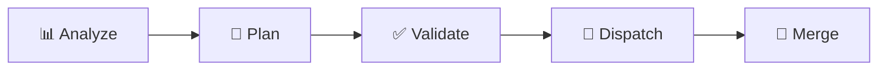
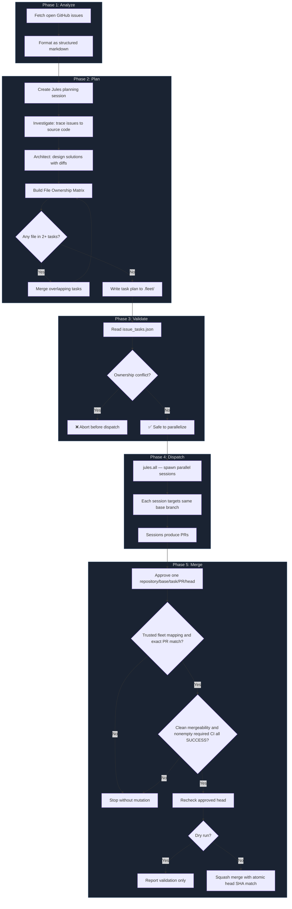

# Automate GitHub Issues

An Agent Skill that sets up your repository to automatically triage and fix GitHub issues using parallel Jules coding agents.

## What It Does

When activated, this skill **bootstraps your repository** with a 5-phase automated pipeline:

## Example Prompt

```text
Set up this GitHub repository to automate issue fixes with Jules.
```

## What Gets Created

The skill copies the following into your repository:

```
scripts/fleet/               # Pipeline scripts (committed to your repo)
├── fleet-analyze.ts
├── fleet-plan.ts
├── fleet-dispatch.ts
├── fleet-merge.ts
├── package.json
├── prompts/
│   ├── analyze-issues.ts    # Issue analysis prompt template
│   └── bootstrap.ts         # Bootstrap prompt for scheduled sessions
└── github/
    ├── git.ts               # Git repo utilities
    ├── issues.ts            # GitHub issue fetching
    ├── markdown.ts          # Issue → markdown formatting
    └── cache-plugin.ts      # ETag-based API caching

.github/workflows/
├── fleet-dispatch.yml       # Manual dispatch (no default cron)
└── fleet-merge.yml          # Manual approval of one fleet PR/head
```

## Prerequisites

- [Bun](https://bun.sh/) runtime
- A [Jules API key](https://jules.google.com/)
- GitHub token with separately authorized merge access; repository branch protection remains required
- GitHub CLI (`gh`) for merge; no Jules SDK is used during merge

### Pipeline Overview



| Phase | Script | What it does |
|-------|--------|-------------|
| **Analyze** | `fleet-analyze.ts` | Fetches open issues → structured markdown |
| **Plan** | `fleet-plan.ts` | Jules diagnoses root causes, builds File Ownership Matrix |
| **Validate** | `fleet-dispatch.ts` | Checks no two tasks claim the same file |
| **Dispatch** | `fleet-dispatch.ts` | Spawns parallel Jules sessions via `jules.all()` |
| **Merge** | `fleet-merge.ts` | Approved PR/head → fleet mapping → required CI → SHA-bound squash |

### Detailed Flow



## Manual Usage

After setup, run the pipeline locally:

```bash
cd scripts/fleet

# Fetch open issues
bun fleet-analyze.ts

# Plan tasks (creates a Jules planning session)
JULES_API_KEY=<key> bun fleet-plan.ts

# Dispatch parallel agents
JULES_API_KEY=<key> bun fleet-dispatch.ts

# Validate one already-reviewed approval; replace placeholders with approved values.
# gh must already have an authorized token; do not put secrets in command history.
FLEET_REPO=owner/repo FLEET_BASE_BRANCH=main FLEET_PR_NUMBER=123 FLEET_HEAD_SHA=APPROVED_40_CHARACTER_SHA FLEET_TASK_ID=task-1 FLEET_DATE=YYYY_MM_DD FLEET_APPROVED=true FLEET_DRY_RUN=true bun fleet-merge.ts
```

The local command and `fleet-merge.yml` call the same `fleet-merge.ts`. After reviewing the dry run, set `FLEET_DRY_RUN=false` only within explicit approval for that exact repository/base/task/PR/head. A changed head requires fresh approval. The workflow defaults to validation only; dispatching it is not permission for future PRs.

Before either entry can proceed, supply trusted `.fleet/YYYY_MM_DD/issue_tasks.json` and `sessions.json` from the explicitly selected dispatch run. The task and unique session mapping must exist, and that same trusted session entry must bind the exact repository and PR number. A complete session token must also match the approved PR branch or body, but candidate text or branch names establish neither provenance nor approval. Do not infer membership from bot authors. The workflow reads records and scripts from the trusted default branch, never a candidate PR; absent records cause a prerequisite error. Providing or committing records is a separate authorized action, not an automatic download or PR checkout.

The existing dispatcher records only `taskId` and `sessionId`; that alone is not merge-ready. An authorized operator must independently verify which PR the session produced, then explicitly provide `repo` (`owner/repo`) and `prNumber` (positive safe integer) in the same trusted `sessions.json` entry, for example:

```json
[{"taskId":"task-1","sessionId":"123456","repo":"owner/repo","prNumber":123}]
```

Never populate this binding from a candidate PR's claim or copied session token. Missing or mismatched bindings stop before any GitHub call, including dry runs. The script does not create or amend these records; operation approval remains a separate requirement.

Only open, non-draft, same-repository PRs with the exact approved base/head and clean mergeability proceed. `gh pr checks --required` must return a nonempty set, all `SUCCESS`; no checks, skipped, pending, failed or API errors stop without merging. Commands have a 30-second timeout; pending CI requires a later explicit invocation, not an unbounded wait. The head is rechecked before the SHA-bound merge request; a non-confirmed merge is an error. The script never updates branches, closes PRs or re-dispatches. Conflicts require human intervention; closing/re-dispatching needs separate authorization through the existing explicit dispatcher, and any new PR/head needs new merge approval.

## Setup (after skill activation)

### 1. Set Secrets

Add `JULES_API_KEY` as a GitHub repository secret (Settings → Secrets → Actions).
`GITHUB_TOKEN` is provided automatically by GitHub Actions.

### 2. Customize

- Dispatch is manual by default. Add cron only after explicit authorization of frequency and scope
- Tune the analysis prompt in `scripts/fleet/prompts/analyze-issues.ts`

### 3. Commit

Commit all generated files and push.

This is not an officially supported Google product.
