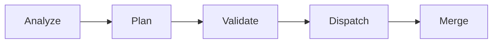

# Architecture: Automate GitHub Issues

This document describes the 5-phase pipeline that gets installed into your repository.

## Pipeline Overview



## Phase 1: Analyze

**Script:** `fleet-analyze.ts`

Fetches all open GitHub issues using the Octokit API with ETag caching. Formats them into a structured markdown document that includes:
- Issue number, title, author, labels
- State, timestamps, reactions
- Full description body

**Output:** Markdown string passed to the planner.

## Phase 2: Plan

**Script:** `fleet-plan.ts`
**Prompt:** `prompts/analyze-issues.ts`

Creates a Jules session that performs deep code-level triage:

1. **Investigate** — Trace each issue to its root cause in the codebase, referencing specific files, functions, and line ranges.
2. **Architect** — Design concrete solutions with TypeScript implementation code, integration diffs, and test scenarios.
3. **Plan** — Group root causes into tasks, produce a File Ownership Matrix ensuring no two tasks touch the same file.
4. **Dispatch** — Write the task plan to `.fleet/{date}/issue_tasks.json` and `.fleet/{date}/issue_tasks.md`.

**Critical constraint:** Merge conflict avoidance. Tasks are dispatched as parallel agents, so file ownership must be exclusive.

## Phase 3: Validate

**Script:** `fleet-dispatch.ts` (built in)

Before dispatching, the orchestrator validates ownership:
- Builds a map of every file claimed by each task (source, new, and test files)
- Throws if any file appears in more than one task
- This prevents merge conflicts when parallel PRs land

## Phase 4: Dispatch

**Script:** `fleet-dispatch.ts`

Spawns parallel Jules sessions using `jules.all()`:
- Each task gets its own session with a self-contained, code-rich prompt
- Sessions target the same base branch
- Session IDs are written to `.fleet/{date}/sessions.json` for the merge phase

## Phase 5: Merge

**Script:** `fleet-merge.ts` *(local)* / `fleet-merge.yml` *(GitHub Action)*

Both entries call the same script for one explicitly approved repository/base/task/PR/head SHA:

1. Require the selected trusted `.fleet/YYYY_MM_DD/issue_tasks.json` and unique `sessions.json` entry binding `taskId`, `sessionId`, `repo` and numeric `prNumber`; repository and PR must match the separate approval. The dispatcher records only task/session, so an authorized operator must independently verify and provide the PR binding (see README). Candidate text, branch tokens and bot-author discovery cannot establish it; missing or mismatched bindings stop before GitHub calls.
2. Check the approved PR/base/head, complete session token, open non-draft same-repository status and clean mergeability
3. Require a nonempty `gh pr checks --required` result with every state `SUCCESS`
4. Recheck the PR/head; in dry-run mode report validation without mutation
5. Otherwise squash-merge with the approved SHA and require `merged: true`

Missing records, pending/skipped/missing CI, conflicts, unknown state or API errors stop without updating, closing or re-dispatching. Each gh call has a 30-second timeout. Human intervention and fresh approval are required after a head change; independent explicit dispatch remains available under its own authorization. See README for inputs and trusted-record provisioning. The Action checks out only the trusted default branch and does not grant new write permissions.

## File Structure (after setup)

```text
scripts/fleet/
├── fleet-analyze.ts             # Fetches open issues as markdown
├── fleet-plan.ts                # Creates the planning session
├── fleet-dispatch.ts            # Validates ownership + dispatches Jules sessions
├── fleet-merge.ts               # One approved PR/head with required CI (shared entry)
├── types.ts                     # Shared TypeScript types
├── package.json                 # Fleet script dependencies
├── prompts/
│   ├── analyze-issues.ts        # The 4-phase analysis prompt
│   └── bootstrap.ts             # Wraps prompt for scheduled sessions
└── github/
    ├── git.ts                   # Git remote parsing (owner/repo/branch)
    ├── issues.ts                # GitHub issue fetching with cache
    ├── markdown.ts              # Issue → markdown formatting
    └── cache-plugin.ts          # Octokit ETag cache plugin
```

## Manual Automation

The `fleet-dispatch.yml` workflow runs the planning phase only on manual dispatch by default. Adding a schedule requires explicit frequency and scope authorization:

1. Installs dependencies from `scripts/fleet/package.json`
2. Runs `fleet-plan.ts` to create a Jules planning session
3. The session fetches issues, analyzes them, and dispatches N parallel agents
4. Each agent produces a PR
5. After review, manually invoke `fleet-merge.yml` with exact approved inputs and trusted records; it defaults to dry run and calls the shared merge script using `gh` CLI
