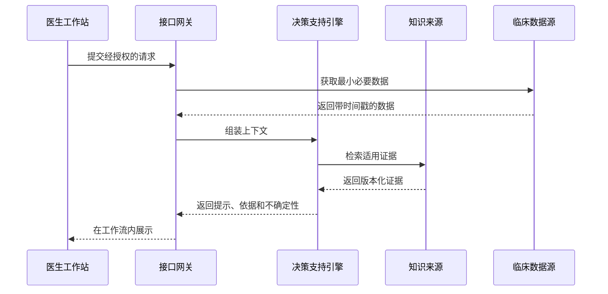

# 散文与矩阵写法对比

本文件只展示表达方式。所有场景、阈值、覆盖范围和性能目标均为占位变量，不构成临床、产品或项目事实。

## 场景：门诊 CDSS 决策支持

### 叙述写法

在诊疗时间受限的场景中，医生需要结合主诉、病史、检查结果和用药信息形成鉴别诊断。决策支持系统可以在医生工作流内呈现与当前病例相关的候选提示及证据来源，但不能替代医生判断，也不能在没有本地验证的情况下声称降低漏诊或达到专家水平。

项目应先确认使用场景、数据质量、临床责任、提示方式和评价指标。若要陈述效果，应记录基线 `{{BASELINE_METRIC}}`、目标 `{{TARGET_METRIC}}`、测量方法 `{{MEASUREMENT_METHOD}}`、证据来源 `{{SOURCE}}` 和资料日期 `{{DATE}}`。

### 矩阵写法

| 维度 | 项目变量 | 验证要求 |
| :--- | :--- | :--- |
| 触发机制 | `{{TRIGGER_POINT}}` | 不打断关键临床操作，完成可用性测试 |
| 输入数据 | `{{REQUIRED_INPUTS}}` | 明确数据权威源、缺失处理和时间戳 |
| 知识来源 | `{{KNOWLEDGE_SOURCES}}` | 记录版本、更新日期和适用范围 |
| 输出格式 | `{{OUTPUT_SCHEMA}}` | 区分提示、证据和不确定性 |
| 响应时间 | `{{P99_LATENCY_TARGET}}` | 说明负载、环境和测量方法 |
| 人机协同 | `{{HITL_ACTIONS}}` | 医生可忽略、修正并留痕 |
| 临床评价 | `{{EVALUATION_PROTOCOL}}` | 需经过本地伦理、合规和临床验证 |

#### 数据流示意

## 使用判断

- 业务背景和决策理由可用短叙述。
- 架构、接口、数据流、测试口径和成本变量通常适合表格或图。
- 表达形式属于人工编辑选择，不应由句数或关键词自动阻断。
