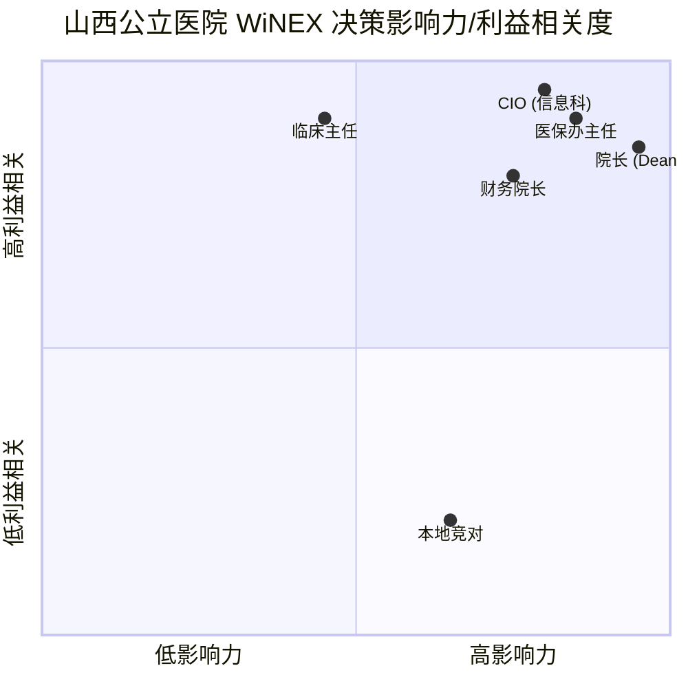

# 01_diagnosis.md - 山西市场 WiNEX 推广深度诊断报告 (V4.1)

## 1. 市场环境与“存量围城”的本质
卫宁健康在山西市场的核心挑战已不再是“产品有无”，而是“代际跃迁的信任危机”。
*   **存量博弈**：山西拥有 100+ 家卫宁老客户，其中以**山大二院**、**山西省儿童医院**为核心。这些客户对 WiNEX 的微服务架构持“观望态度”，核心痛点在于：担心 C/S 向微服务迁移导致的数据丢失与长达半年的业务磨合期。
*   **财政冰封期**：2025-2026 年山西公立医院 CAPEX 支出受限。院长不再为“数字化概念”买单，只为“生产力收益”付钱。
*   **外部蚕食**：本地厂商利用“省内维保快速响应”和低价策略，正从云影像等外围系统切入，试图实现“中心化替代”。

## 2. 虚拟专家圆桌会议 (Deep Insights)
*   **山西某大型三甲 CIO**：“我们不需要 24 小时切换这种噱头，我们需要的是 3 个月能跑通全业务流程的稳定承诺。如果 WiNEX 能做到 1 个月试点、2 个月全院铺开，我就敢报专项债。”
*   **省医保局精算专家**：“2026 年山西 DRG 分组方案将迎来新一轮权重调整。如果医院的系统依然是‘事后结算’而非‘诊间预警’，每年的医保拒付亏损将至少吞噬其 5-8% 的净利润。”
*   **卫宁前线大区总**：“山西客户极度依赖‘邻院效应’。只要我们能把医保盈余的数据在一家三甲医院做透，全省的院长都会坐不住。”

## 3. 利益相关者象限分析 (Visual Stakeholders)

## 4. 2026 市场量化预测
*   **山西医疗 IT 升级 TAM**：约 5.5 亿元人民币。
*   **卫宁年度捕获目标 SOM**：1.35 亿元 (基于 27.5% 的存量深度转化)。
*   **关键成效预测**：通过 WiNEX 升级，预计可为山西三级医院平均挽回 **300 万元/年** 的不合理医保扣费。
