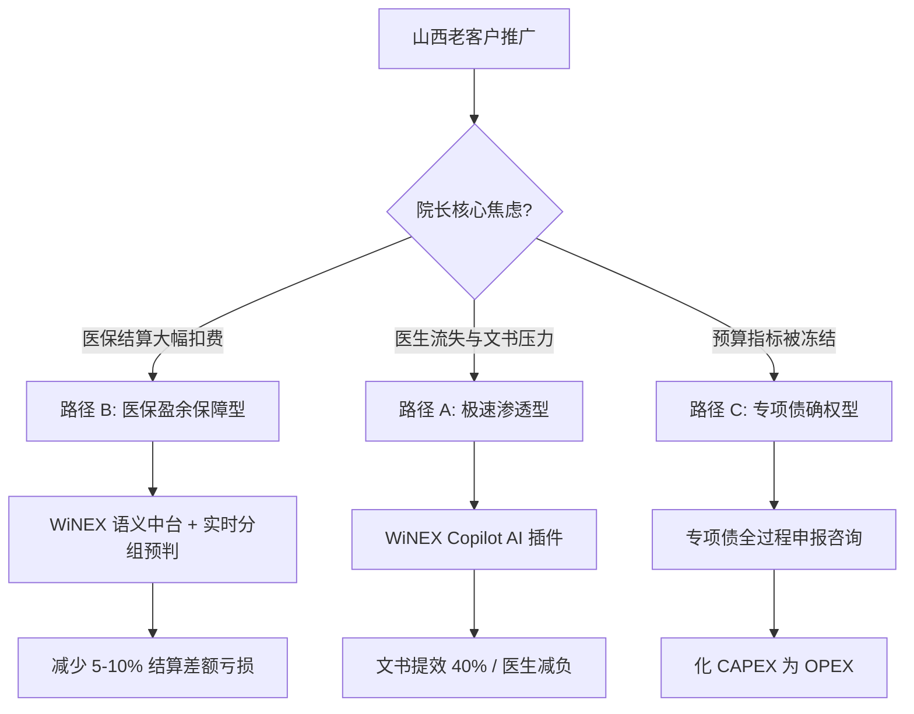

# 02_strategy_branches.md - 山西市场 WiNEX 战略决策矩阵 (V4.1)

## 1. 战略分歧决策树 (Decision Tree)

## 2. 路径 B：管理确权与医保盈余保障 (核心主攻方向)
针对 2026 年山西 DRG/DIP 权重调整窗口，将 WiNEX 从“软件”重塑为“盈余防御系统”。
*   **核心逻辑**：利用 WiNEX 的医疗语义层 (MSL)，在医生下达医嘱时实时匹配“山西版分组器”，发现“低套分值”或“高风险项”立即预警。
*   **打法**：**“对冲成本法”**。通过预期的年挽回损失（200-500万）直接抵扣 WiNEX 升级年费，实现项目的“零经济成本感”。
*   **交付底线**：**3 个月上线**。1个月打通医保办、财务部、临床科室的闭环，2个月实现全院覆盖。

## 3. 路径差异化量化对比

| 维度 | 路径 A: Copilot 特洛伊木马 | 路径 B: 医保盈余 (Top Priority) | 路径 C: 专项债/资产轻量化 |
| :--- | :--- | :--- | :--- |
| **战略定调** | 临床驱动 (Bottom-up) | **经营驱动 (Top-down)** | 财务驱动 (Compliance) |
| **技术核心** | WiNGPT 3.5-Turbo | **MSL 语义层 + DRG 预判引擎** | WiNEX 云交付架构 |
| **财务逻辑** | 小额增值采购 | **医保增收对冲建设费** | 专项债/技术服务费 |
| **市场杀伤力** | 中 (局部渗透) | **高 (全省院长级刚需)** | 高 (解决钱的问题) |
