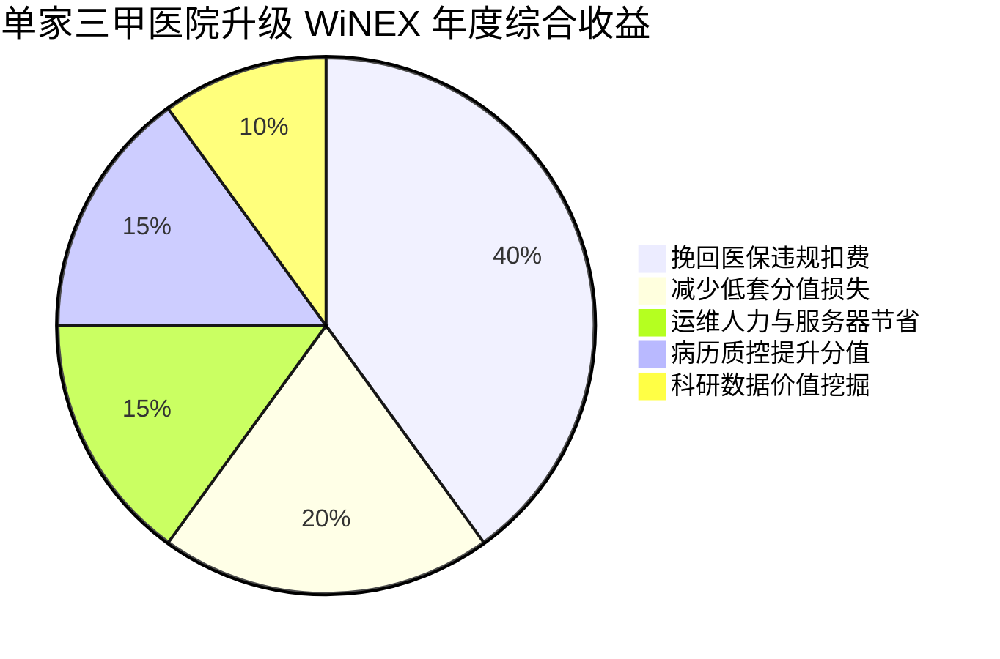

# 04_metrics.md - 山西 WiNEX 推广量化成效与 ROI 分析 (V4.1)

## 1. 客户价值构成分析 (Waterfall Chart Logic)

## 2. 核心 KPIs 与市场目标
*   **市场确权**：年度签约目标 **1.35 亿元**；实现山西省 30% 存量客户迁移。
*   **工程指标**：单院上线周期平均值 **95 天**；历史数据无损迁移率 **100%**。
*   **经济指标**：路径 B 客户平均医保结算盈余提升 **5%**。

## 3. 500 床位级三甲医院 ROI 测算
*   **总建设投入**：约 500 万元 (含底座升级 + 医保盈余模块)。
*   **年均直接收益**：
    *   挽回医保拒付：约 150 万元。
    *   减少重复检查损耗：约 80 万元。
    *   临床书写提效 (折合人力成本)：约 60 万元。
*   **静态回收期**：约 **1.8 年**。
*   **五年期 ROI**：**3.4** (即每投入 1 元，产生 3.4 元社会与经济综合回报)。
