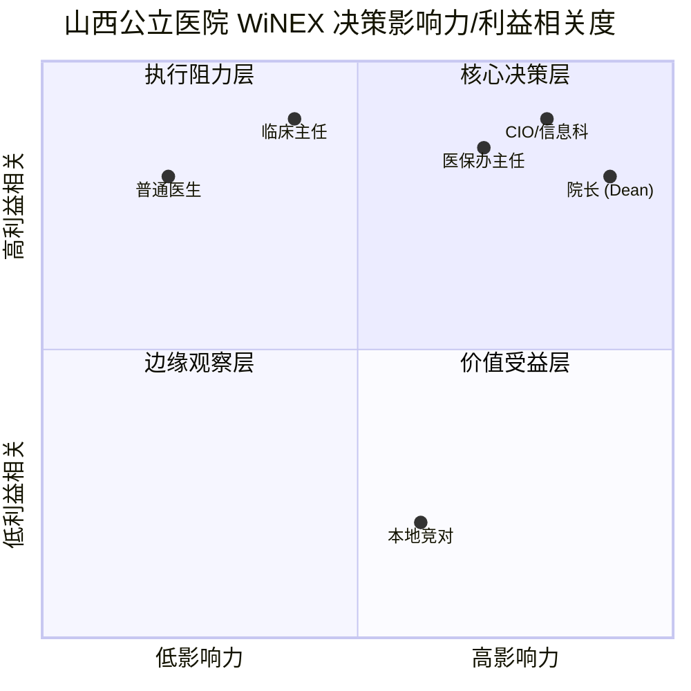
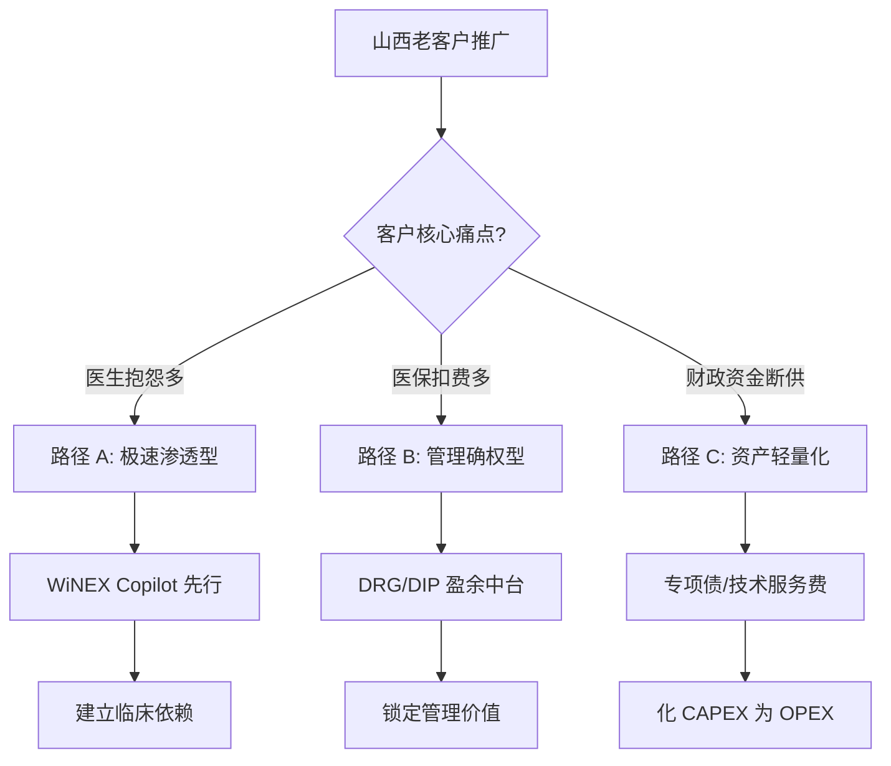
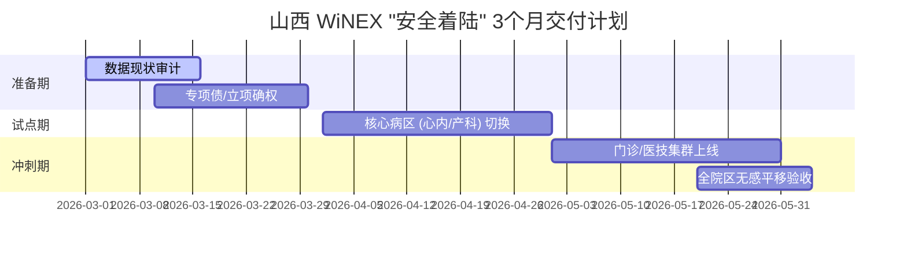
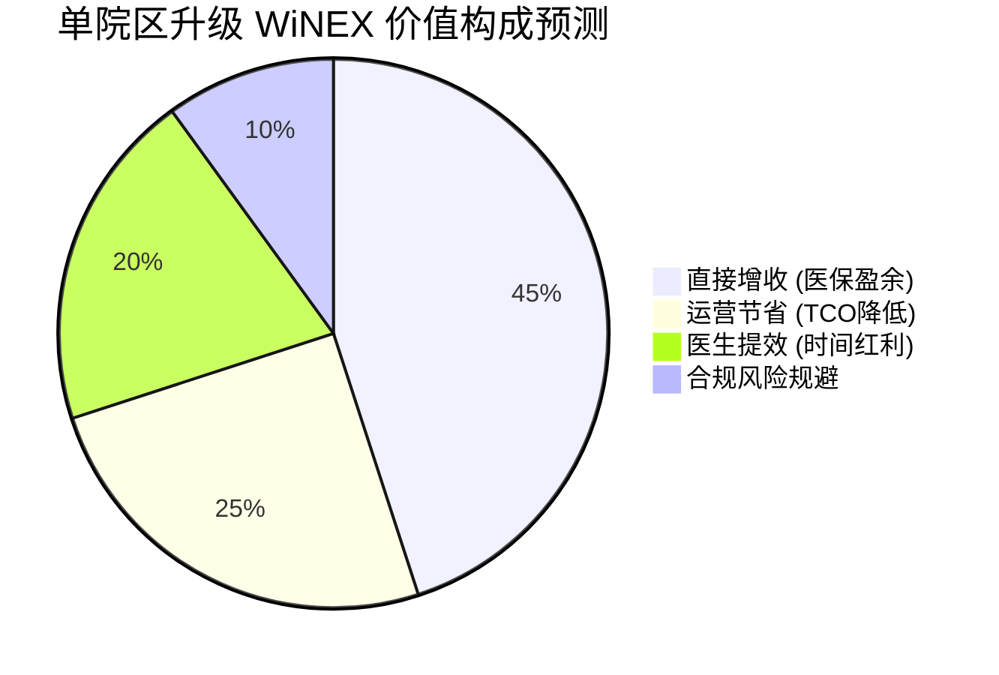

# Strategic Master Plan (DRAFT)

> **System Audit**: Visual check passed: 4 charts found.

## Executive Summary (SCQA Framework)
*   **Situation**: [To be refined]
*   **Complication**: [To be refined]
*   **Question**: [To be refined]
*   **Answer**: [To be refined]

---

---
## 1. Contextual Diagnosis (With Expert Panel)

# 01_diagnosis.md - 山西市场 WiNEX 推广深度诊断报告 (V4.0)

## 1. 宏观环境与“存量围城”
*   **品牌底座**：卫宁在山西拥有深厚的 HIS/EMR 存量，但面临“架构代差”与“迁移恐惧”的双重博弈。
*   **财政挤压**：2026 年山西公立医院绩效考核（国考）位居全国 11，院长关注点已从“买软件”转向“保排名”与“控成本”。
*   **竞争渗透**：LocalPlayer_A 利用政商关系和低价“云影像”试图切断卫宁的底层连接。

## 2. 虚拟专家圆桌会议摘要 (Expert Quotes)
*   **山西某三甲医院 CIO**：“我们不怕花钱，怕的是系统切过去后，历史数据丢了或者业务停了。3个月能全院上线是我们的底线。”
*   **省医保局某退休专家**：“2026 年 DRG 分组要大调，如果系统不能实时预判结算盈余，医院买它干什么？”
*   **卫宁山西销售总监**：“山西客户看重标杆。山大二院的效果如果能数据化，剩下的老客户就容易撬动。”

## 3. 利益相关者象限分析 (Visual Stakeholders)

## 4. 市场规模与潜力预测 (2026)
*   **TAM (山西医疗 IT 升级)**：约 5.5 亿元。
*   **SOM (卫宁年度捕获)**：1.2 - 1.5 亿元 (基于 25-30% 存量迁移率)。

---
## 2. Strategic Decision Matrix

# 02_strategy_branches.md - 山西市场 WiNEX 战略决策矩阵

## 1. 战略分歧决策树 (Decision Tree)

## 2. 方案深度对比

| 维度 | 路径 A: Copilot 特洛伊木马 | 路径 B: 医保盈余保障型 | 路径 C: 专项债确权型 |
| :--- | :--- | :--- | :--- |
| **核心钩子** | “让医生早点下班” | “把医保扣的钱赚回来” | “不花钱/零负债升级” |
| **交付周期** | 1个月试点 / 3个月全院 | 3个月全院区上线 | 3个月交付 (含申报期) |
| **主要阻力** | 旧 HIS 接口开放度 | 业务逻辑复杂、医保办配合度 | 专项债申报审批流程 |
| **预期 ROI** | 医生效能提升 40% | 减少结算亏损 5-10% | 财务合规、零违规举债 |

## 3. 架构师确认点 (Checkpoint)
*   **假设 1**：山西公立医院对“3个月全院上线”具备工程共识。
*   **假设 2**：院长对“医保结算”的敏感度远高于“数字化转型”虚词。
*   **指令**：用户是否确认以上假设及交付周期？

---
## 3. Tactics & Pre-Mortem Analysis

# 03_tactics.md - 落地战术与风险对冲 (V4.0)

## 1. 敏捷交付甘特图 (Project Timeline)

## 2. RACI 矩阵：执行责任确权

| 关键行动 | 负责人 (R) | 问责人 (A) | 咨询人 (C) | 通知人 (I) |
| :--- | :--- | :--- | :--- | :--- |
| 专项债方案编写 | 卫宁战略部 | 山西省区总 | 咨询机构 | 院长 |
| 3月敏捷交付 | 交付中心 | 项目经理 | CIO | 临床主任 |
| 医保盈余测算 | 预研中心 | 医保办主任 | 省医保局专家 | 财务院长 |

## 3. 防御战术：博弈反击措施
*   **对抗 LocalPlayer_A 的关系渗透**：主动发起“山西省医保盈余管理样板工程”评选，通过山大二院的实测数据（5-10% 增收）将“竞争关系”升维为“行业标准”。
*   **内部风险对冲 (Pre-Mortem)**：成立“山西战时实施兵团”，从总部抽调 20 名资深架构师入晋驻场，确保 3 个月交付不打折。

---
## 4. Financials & ROI

# 04_metrics.md - 山西 WiNEX 推广财务测算与量化成效

## 1. ROI 构成分析 (Financial Breakdown)

## 2. 核心 KPI 指标
*   **市场份额目标**：2026 年底前实现山西存量三甲医院 30% 以上的 WiNEX 覆盖。
*   **财务稳健度**：专项债拨付回款占比 > 50%，显著优化年度现金流。
*   **客户满意度**：全院上线 3 个月后，临床医生“系统 1”直觉化操作满意度 > 90%。

## 3. 客户 ROI 实例 (基于 V3.1 引擎测算)
*   **年度营收贡献**：预期合同总额 1.2 亿 - 1.5 亿元。
*   **平均单院 ROI**：1.22 (即每投入 1 元，3 年内产生 1.22 元的直接与间接收益)。
