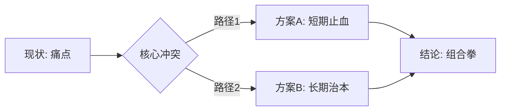

# Deck Blueprint Page Template (MBB Reference)

<!-- 
Vision: 每一页幻灯片的极致结构化定义，以及全局视觉灵魂的锁定
用途分治：本文件为高端交付物级别的设计蓝图模板，含演讲稿与 Q&A 预演。
         如需 Agent 自动化解析的标准格式，请使用 outline-template.md。
-->

## 0. 全局视觉风格蓝图 (Global Style Instructions)

**// 视觉灵魂锁定**
> 在进行单页设计前，必须首先锁定整套文稿的视觉 DNA。

<STYLE_INSTRUCTIONS>

**Design Aesthetic (设计美学):** 
[例如: "Digital Constructivism" (数字构成主义)。结合瑞士平面设计的网格系统与终端代码（Terminal）的极客美学。]

**Color Palette (调色板):**
*   **Primary Background (主背景):** [Hex Code] - [使用场景说明]
*   **Emphasis Background (强调背景):** [Hex Code] - [使用场景说明]
*   **Action Color (行动色):** [Hex Code] - [高亮/引导]
*   **Neutral/Text (中性/文字):** [Hex Code] - [正文/辅助]

**Typography (字体系统):**
*   **Title/Lead-in (标题):** [Font Name/Style Description]
*   **Body (正文):** [Font Name/Style Description]
*   **Data/Code (数据/代码):** [Font Name/Style Description]

**Visual Elements (视觉元素):**
*   [元素 1]: [描述其渲染特征，如“细线框图”、“磨砂玻璃效果”]
*   [元素 2]: [禁忌事项，如“避免拟人化机器人图片”]

**Layout Constraints (布局约束):**
[例如: 统一采用 8px 网格系统，边距保持 10% 呼吸感。]

</STYLE_INSTRUCTIONS>

---

## 1. 故事线可视化 (Storyline Map)

**// LOGIC FLOW (逻辑流向)**
> [使用 Mermaid 流程图直观展示各章节之间的逻辑关系：并列、递进或冲突]



---

## 页面设计蓝图规范

### Page [X]: [叙事性主题句 - 严禁描述性标题，必须包含观点/结论]

---

**// NARRATIVE GOAL (叙事目标)**
> [解释本页在 SCQA 或金字塔故事线中的核心作用。它解决了听众的哪个疑虑？或者为下一页的哪个结论做了什么铺垫？]

**// KEY CONTENT (六段式解剖学映射)**
*   **Kicker (判词标题):** [有穿透力的主标题，直接回答“So What?” (15-25字)]
*   **Lead-in (引言/副标题):** [一句话解释背景或逻辑前提]
*   **Body (视觉主干):** [核心图表结构，严禁纯文本 > 3 个 Bullet。必须包含对比基线 Baseline]
*   **Evidence (证据点):**
    *   [论据 1]: 源自素材的核心事实/数据。
    *   [对比数据]: 现状 vs 目标 / 竞品 vs 我方。
*   **Trust_Anchor (信任锚点):** [权威来源映射，如 NHC发文/CHIMA年鉴/客户案例，加强信服力]
*   **Bumper (底部收言):** [提炼本页对决策者的实际行动意义 (≤20字)]

**// VISUAL_CODE (结构化视觉微码)**
```json
{
  "chart_type": "[图表类型: 如 Waterfall, Radar, Pyramid, Comparison]",
  "layout_logic": "[1/3 Split, Golden Ratio, Centered Focus]",
  "key_elements": ["[元素1]", "[元素2]"],
  "visual_metaphor": "[核心视觉隐喻]",
  "automation_prompt": "[供下游生成的提示词摘要]"
}
```

**// VISUAL_DESCRIPTION (视觉画面详述)**
> [详细描述构图、配色、阴影效果。例如：左侧 40% 放置核心断言文字，右侧 60% 为高对比度的趋势图表。]

**// LAYOUT (布局结构)**
> [例如：1/3 垂直分割布局。左侧为结论区（高对比度底色），右侧为详情区（白色背景），视线从左上角标题引导至右侧数据。]

**// Script (演讲者增强)**
*   **逐字稿**: [语气：专业、坚定、富有启发性。]
*   **注意事项**: [例如：此处需停顿 2 秒以增强视觉冲击力；注意强调数据背后的不确定性。]
*   **Key Takeaway (核心记忆点)**: [听众离开会场后必须记住的一句话。]
*   **Potential Q&A (红队预演)**:
    *   Q1: [最可能被挑战的逻辑漏洞] -> A1: [防御性回答]
    *   Q2: [最可能被质疑的数据] -> A2: [数据源背书]

---

## 视觉风格特别准则 (Poster-style Slides)

### 封面 (Title Slide)
*   **风格**: 海报式布局 (Poster-style)。
*   **视觉**: 满版出血大图 (Full-bleed) 或 极端简约的几何构图。
*   **文字**: 只有主标题、副标题和品牌标识，严禁任何细碎文字。

### 封底 (Closing Slide)
*   **风格**: 行动锚点式 (Call to Action)。
*   **视觉**: 与封面遥相呼应，强调核心愿景。
*   **文字**: 一个强有力的金句或一个清晰的下一步行动建议。
